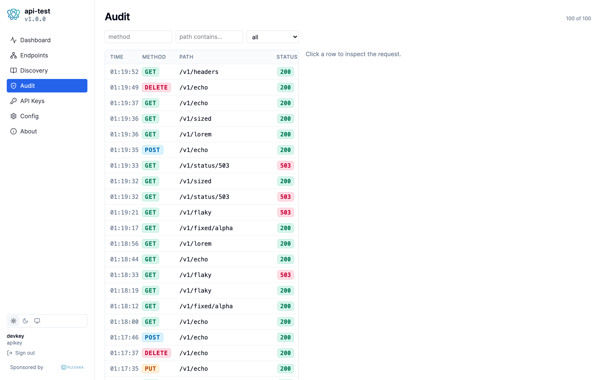

# api-test

[](https://github.com/plexara/api-test/actions/workflows/ci.yml)
[](https://github.com/plexara/api-test/actions/workflows/codeql.yml)
[](https://pkg.go.dev/github.com/plexara/api-test)
[](LICENSE)

A controllable HTTP REST fixture used to exercise API gateways (Plexara's
in particular). Sister project to [mcp-test](../mcp-test), which plays the
same role for the MCP gateway.

📖 **Documentation: <https://api-test.plexara.io/>**

## Why

Plexara MCP exposes two gateway capabilities:

- **MCP gateway** — registers upstream MCP servers as connections. Tested
  by `mcp-test`.
- **API gateway** — registers upstream HTTP APIs as connections; exposes
  three MCP tools (`api_invoke_endpoint`, `api_list_endpoints`,
  `api_export`). Tested by **`api-test`** — this project.

`api-test` is the upstream HTTP fixture the API gateway calls. Endpoints
are deliberately simple and deterministic; their job is not to compute
anything useful, it's to make the gateway's behavior observable. Every
request is recorded in a Postgres-backed audit log so you can compare
what a client sent through Plexara, what reached this server, and what
came back.

### Why not httpbin / mockoon / Prism?

Those are great mocks. api-test is a different shape:

- **Audit log of every request** — sanitized headers, query params,
  request and response bodies, identity, latency, status — queryable in
  Postgres and browsable from the embedded portal. Mocks tell you they
  served a request; api-test tells you *what the gateway sent*.
- **Real inbound auth** — file API keys, bcrypt-hashed Postgres-backed
  keys, static bearer tokens, and OIDC JWT validation. Mocks let
  anything through; api-test rejects bad credentials the way a real
  upstream does.
- **Gateway-specific endpoint groups** — one endpoint per pagination
  cursor style the gateway recognizes; one endpoint per security probe
  the gateway should reject; failure modes with seeded determinism so
  retry/timeout tests are reproducible.
- **In-tree OpenAPI** — every route is published at `/openapi.json`,
  generated from the same metadata the portal uses, so the gateway's
  `api_list_endpoints` tool sees an exact contract.

## Endpoint groups

- **identity** — `GET /v1/whoami`, `GET /v1/headers`. Verify the gateway
  forwards identity, args, and HTTP headers (with redaction).
- **data** — `GET /v1/fixed/{key}`, `GET /v1/sized?bytes=N`,
  `GET /v1/lorem?words=N&seed=S`. Deterministic outputs for testing
  enrichment dedup, response-size handling, and caching.
- **failure** — `GET /v1/status/{code}`, `GET /v1/slow?ms=N`,
  `GET /v1/flaky?fail_rate=&seed=&call_id=`. Controlled failure modes
  for retry/timeout policy testing.
- **echo** — `ANY /v1/echo`. Generic catch-all that returns the request
  verbatim (with auth headers redacted).
- **streaming** — chunked, SSE, and NDJSON variants for stream-proxy
  testing.
- **pagination** — RFC 5988 Link, OData v4, and opaque-cursor styles;
  same synthetic dataset under all three so cross-style assertions are
  bit-equal.
- **methods** — HTTP method matrix (GET/POST/PUT/PATCH/DELETE/HEAD/OPTIONS)
  for verifying method pass-through.
- **security** — SSRF / path-traversal / admin-prefix probes the
  gateway should reject upstream.
- **export** — long-running / large-payload targets for the gateway's
  `api_export` tool.

## Web portal

A React SPA embedded into the binary (`/portal/`) gives you a browsable
audit log with filters, charts, request/response payload drawers, an
endpoint catalog, and a Try-It form that proxies through the same auth
chain as `/v1/*`. Sign in with OIDC or paste an API key.



## Prerequisites

- **Go 1.26+** for `go run` / `make build`.
- **Docker** for the full stack (Postgres + Keycloak via
  `docker-compose.dev.yml`) and for the integration test suite
  (testcontainers).
- **pnpm + Node 20+** only if you change the SPA (`make ui`). The
  pre-built bundle ships embedded; you can run the binary without
  Node installed.

Postgres is **optional**: `make dev-anon` runs the binary with no DB,
no audit, no portal — fastest loop for endpoint work.

## Quickstart

```bash
go run ./cmd/api-test --config configs/api-test.dev.yaml
# in another shell:
curl -s http://localhost:8080/v1/whoami
curl -s 'http://localhost:8080/v1/sized?bytes=64'
curl -s http://localhost:8080/v1/status/418
curl -s -X POST http://localhost:8080/v1/echo -H 'Content-Type: application/json' -d '{"hi":1}'
```

- `make dev-anon` — same thing, anonymous mode, Postgres-only (no Keycloak).
- `make dev` — full stack: Postgres + Keycloak + portal. First run writes
  `.env.dev` with random API-key + cookie secrets (gitignored, reused).
- `make build` — produces `./bin/api-test`.

## Tests

```bash
make test           # unit + in-memory; go test -race -count=1 ./...
make integration    # //go:build integration; testcontainers Postgres (needs Docker)
make verify         # CI-equivalent gate: fmt + vet + lint + test + security + coverage + codeql
```

`make verify` is the single source of truth for "is this tree
shippable" — same commands CI runs. The pre-commit hook reads
`.claude/.last-verify-passed` (written only after a full pass).

## Layout

```
cmd/api-test            # binary entry
internal/server         # composition root (config + endpoints + httpsrv + portal)
internal/ui             # //go:embed all:dist — SPA bundle
pkg/apikeys             # Postgres-backed bcrypt API keys
pkg/audit               # Event/Payload model, AsyncLogger, in-memory + Postgres stores
pkg/auth/inbound        # APIKey / Bearer / OIDC authenticators + Chain
pkg/config              # YAML loader + ${VAR:-default} env interpolation
pkg/database            # pgxpool wrapper + golang-migrate runner
pkg/endpoints/{...}     # identity, data, failure, echo, streaming, pagination,
                        # methods, security, export
pkg/httpmw              # RequestID, AccessLog, Identity, Audit middleware
pkg/httpsrv             # mux composition + portal API + SPA serving + health
pkg/oapi                # in-tree OpenAPI 3.x generator (reflection-based)
configs/                # *.dev.yaml (anon), *.live.yaml (full), *.example.yaml
ui/                     # React + Vite + Tailwind portal source
```

## License

Apache 2.0 — see [LICENSE](LICENSE).
