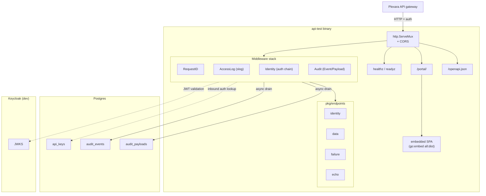
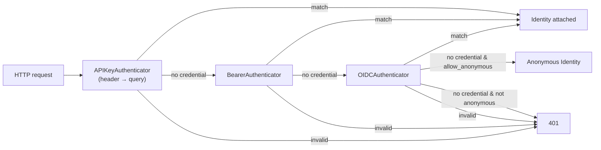
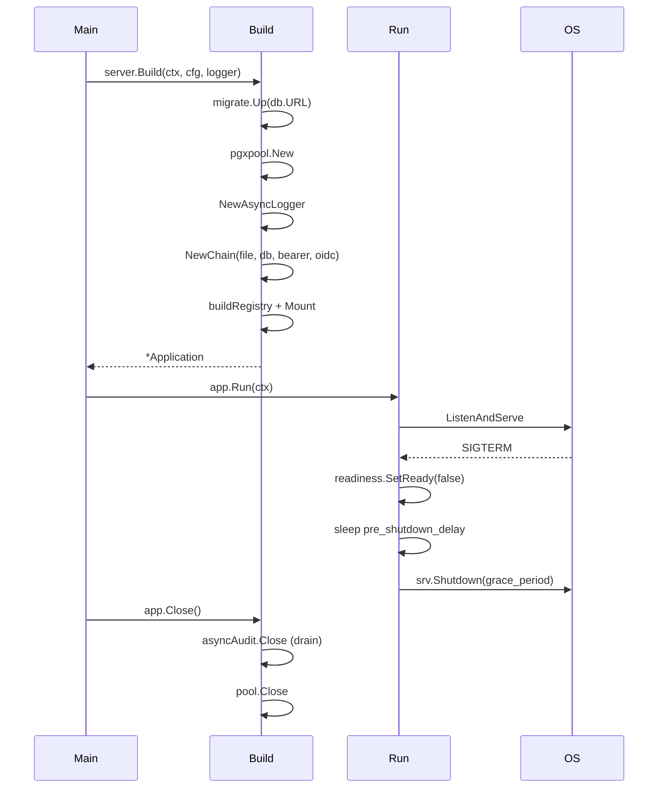

# Architecture

api-test is a small, intentionally legible Go service. The
composition root (`internal/server.Build`) wires four things together:
config, database (optional), auth chain, endpoint registry; the result
is an `http.Handler` that's served from `cmd/api-test/main.go`.

## Component diagram



## Request flow

For an inbound `/v1/*` request, outermost first:

1. **RequestID**: preserves inbound `X-Request-Id` or generates a new
   UUID; echoes on the response; stashes in context; seeds the
   per-request `identityHolder` so AccessLog can later read what
   Identity wrote.
2. **AccessLog**: records start time. Wraps the response writer to
   capture status + bytes; emits one `slog.Info` line on completion
   with method, path, status, duration, request_id, and (when the
   per-route Identity middleware ran) auth_type + subject.
3. **CORS**: sets `Access-Control-*` headers; preflight (OPTIONS)
   short-circuits with 204.
4. **mux dispatch**: Go 1.22+ method+path pattern matcher selects the
   per-route chain (or one of the bare health/well-known/root
   handlers, which skip the per-route middleware below).
5. **Identity** (per-route): runs the inbound auth chain. On match,
   attaches the `inbound.Identity` to the context, mirrors it into
   the holder seeded by RequestID, and calls the next handler. On
   mismatch, responds 401 with `WWW-Authenticate`.
6. **Audit** (per-route): starts an event timer; tees the request body
   into a capped buffer; wraps the response writer to capture body
   and status. After the handler returns, builds an `audit.Event`
   (and optional `Payload`) and calls `auditLog.Log` (non-blocking —
   the `AsyncLogger` enqueues into a buffered channel and returns).
7. **Endpoint handler**: reads the request body, builds the response.
   For `whoami`, reads the identity off context.

Health (`/healthz`, `/readyz`) and well-known endpoints sit *outside*
the Identity + Audit middleware so they don't generate audit rows or
require credentials.

## Auth chain

`pkg/auth/inbound`:



A bad credential **stops the chain immediately** (no fall-through).
Only *absent* credentials advance. This prevents accidental cross-mode
matches.

## Audit pipeline

```mermaid
flowchart LR
    Handler["Request handler"] -->|Event{}| Async["AsyncLogger<br/>(buffered channel)"]
    Async -->|drain goroutine| PG["Postgres store"]
    PG --> EvT[(audit_events)]
    PG --> PlT[(audit_payloads)]
    Async -.->|on full buffer| Drop["drop + counter++"]
```

- `AsyncLogger.Log` is non-blocking. The handler's request path never
  waits on the database.
- The drain goroutine writes one event at a time with a per-call
  timeout (`5s` default).
- Summary and detail rows commit in the same transaction so they're
  atomically visible.
- A full buffer drops events; the drop counter is logged at WARN
  every 1000th drop.

## Embed model

```
internal/ui/embed.go
   //go:embed all:dist
   var distFS embed.FS
```

The portal SPA is compiled into the binary at build time. `make ui`
runs `pnpm install && pnpm build` in `ui/`, then copies `ui/dist/`
into `internal/ui/dist/`. `go build` picks up the embed automatically.

When `internal/ui/dist/` only contains `.gitkeep` (no SPA built), the
mux falls back to a small JSON banner at `/portal/` so the binary still
runs without the Node toolchain.

## Lifecycle



## Reusing pieces

The packaging is opinionated but the pieces are independent:

- `pkg/config` — YAML loader with `${VAR:-default}` interpolation. No
  api-test deps.
- `pkg/database` + `pkg/database/migrate` — pgxpool wrapper +
  golang-migrate runner. Generic.
- `pkg/audit` — Logger interface, in-memory + Postgres impls,
  AsyncLogger wrapper. The Event/Payload shape is HTTP-flavored but
  the surface is generic.
- `pkg/auth/inbound` — Authenticator interface + chain composer.
- `pkg/httpmw` — RequestID, Identity, AccessLog, Audit. Drop-in for
  any Go service.
- `pkg/endpoints` — registry pattern. The `Endpoints` interface (Name,
  Routes, Mount) is a useful organizational tool for any service
  with many routes grouped by behavior.

Lift any of these into your own service with the import path rewritten.
